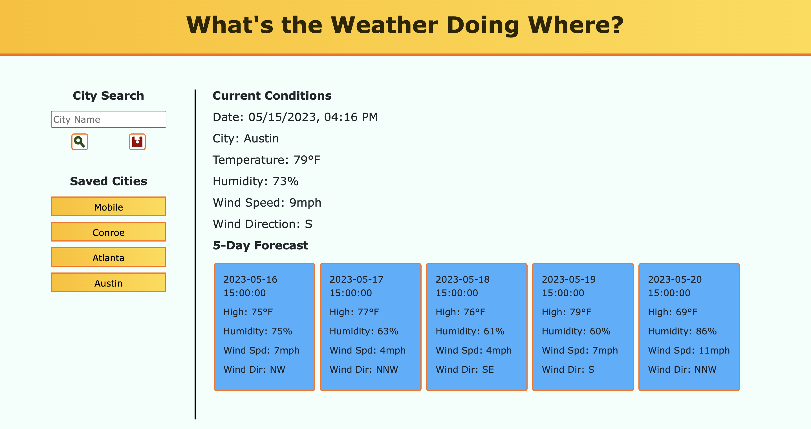

# <06-Weather-Dashboard>

## Description

Travel may be a big part of your life. One of the first things we always look at when traveling, is what the weather is doing and will be doing. The Weather Dashboard app is a great tool to keep handy on your PC, laptop or smartphone. You cna very quickly checkout relevant weather information that you are needing to know. You have the opportunity to save your favorite cities to a list. This enables you to quickly retrieve weather information for a specific city to which you may be traveling. You also have the option to enter another city of choice and quickly retrieve weather data. The app provides you with current conditions that are updated every 3 hours. It also provides you with an 8-day forecast of approaching weather for the city of choice. Take time to review this app. You will be glad you did...and you will find it extremely useful!

## Installation

You can access the Weather Dashboard app by going to:

https://waynefenwick.github.io/06-Weather-Dashboard/

## Using the App

* In the search bar, type your city of choice and click the search icon
* In a short moment, you will quickly see the current conditions of that city as well as an 8-day forecast.
* That city will automatically be saved to a favorites list.
* You may be traveling to more than one city: enter another city name again and you will be good to go.
    
    
## Mockup

## Credits

* I do have a tutor who helped me finalize and tweak this app. Thank you very much Byron!

* OpenWeatherMap.org is a great resource for weather tracking tools. Take a moment to visit https://home.openweathermap.org/users/sign_in

## License

MIT License

Copyright (c) 2023 Fersill53

Permission is hereby granted, free of charge, to any person obtaining a copy
of this software and associated documentation files (the "Software"), to deal
in the Software without restriction, including without limitation the rights
to use, copy, modify, merge, publish, distribute, sublicense, and/or sell
copies of the Software, and to permit persons to whom the Software is
furnished to do so, subject to the following conditions:

The above copyright notice and this permission notice shall be included in all
copies or substantial portions of the Software.

THE SOFTWARE IS PROVIDED "AS IS", WITHOUT WARRANTY OF ANY KIND, EXPRESS OR
IMPLIED, INCLUDING BUT NOT LIMITED TO THE WARRANTIES OF MERCHANTABILITY,
FITNESS FOR A PARTICULAR PURPOSE AND NONINFRINGEMENT. IN NO EVENT SHALL THE
AUTHORS OR COPYRIGHT HOLDERS BE LIABLE FOR ANY CLAIM, DAMAGES OR OTHER
LIABILITY, WHETHER IN AN ACTION OF CONTRACT, TORT OR OTHERWISE, ARISING FROM,
OUT OF OR IN CONNECTION WITH THE SOFTWARE OR THE USE OR OTHER DEALINGS IN THE
SOFTWARE.
